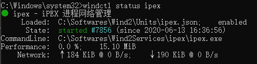

> Wind 服务主机命令行控制器

### 安装
0. 需要 [dotnet core runtime 3.1](https://dotnet.microsoft.com/download/dotnet-core/3.1)
1. 下载发行包文件并解压到本地磁盘,我建议 `C:\ProgramData\WindController\`
2. 将安装目录添加到环境变量
3. 打开一个具有 **Administrator** 权限的命令行窗口
4. 执行 `windctl.exe` 并且不加任何参数

### 卸载
删除文件即可

### 命令
> **windctl** 的版本必须与服务主机一致

- windctl version
  > 输出此工具的版本
- windctl status **\<unitKey\>**
  > 获取单元的状态
- windctl start **\<unitKey\>**
  > 启动单元
- windctl stop **\<unitKey\>**
  > 停止单元
- windctl restart **\<unitKey\>**
  > 重启单元
- windctl load **\<unitKey\>**
  > 从单元配置文件加载或更新单元配置
- windctl remove **\<unitKey\>**
  > 停止并移除单元,无法再次启动这个单元
- windctl start-all
  > 启动所有单元
- windctl stop-all
  > 停止所有单元
- windctl restart-all
  > 重启所有单元
- windctl load-all
  > 从单元配置文件加载或更新单元配置
- windctl remove-all
  > 停止并移除所有单元,无法再次启动这些单元
- windctl daemon-version
  > 获取服务主机的版本
- windctl daemon-shutdown
  > 关闭服务主机

### Showcase
