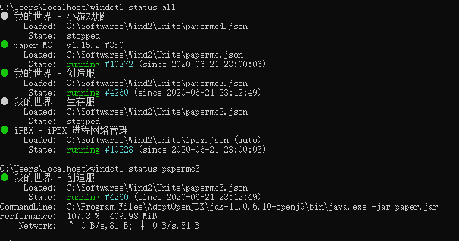

> Wind daemon service command-line controller

### Install
0. require [dotnet core runtime 3.1](https://dotnet.microsoft.com/download/dotnet-core/3.1)
1. download released package file and unzip to local disk,i suggest `C:\ProgramData\windctl\`
2. add install directory to environment variable
3. execute `windctl.exe` without any argument

### Uninstall
just delete files

### Commands
> **windctl**'s version must equal **wind**'s version
- windctl version  
print this tool's version
- windctl status **\<unitKey\>**  
print unit's status
- windctl start **\<unitKey\>**  
start unit
- windctl stop **\<unitKey\>**  
stop unit
- windctl restart **\<unitKey\>**  
restart unit
- windctl load **\<unitKey\>**  
try load/update unit's settings from file
- windctl remove **\<unitKey\>**  
stop unit and remove it,it can not be start again
- windctl logs **\<unitKey\>**  
print unit's last lines logs
- windctl status-all  
print all unit's status(lite)
- windctl start-all  
start all unit
- windctl stop-all  
stop all unit
- windctl restart-all  
restart all unit
- windctl load-all  
try load/update all units's settings from file
- windctl remove-all  
stop all unit and remove them,they can not be start again
- windctl daemon-version  
print daemon service's version
- windctl daemon-status  
print daemon service's status
- windctl daemon-shutdown  
shutdown daemon service

### Showcase

